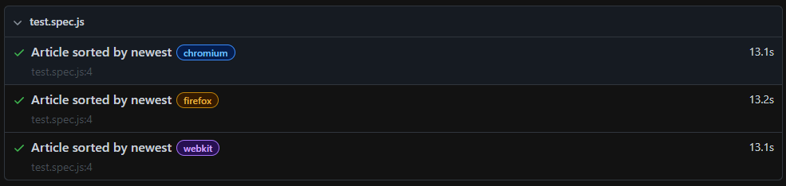

## Test Description ✏️

-   Retrieves the first 100 articles from [Hacker News/newest](https://news.ycombinator.com/newest).
-   Validates `sortHackerNewsArticles` returns a non-null object.
-   Validates 100 articles are fetched.
-   Validates articles are sorted by latest.

## Set up

1. Run `npm i` to install local dependencies
2. `npm run test` to run test
3. `npm run report` to show test report in local web server

## Note

-   `chromium` required a 2.5 second buffer between each request.

## References

-   [Use resilient HTML attributes](https://www.qawolf.com/blog/create-end-to-end-tests-like-a-qa-wolf)
